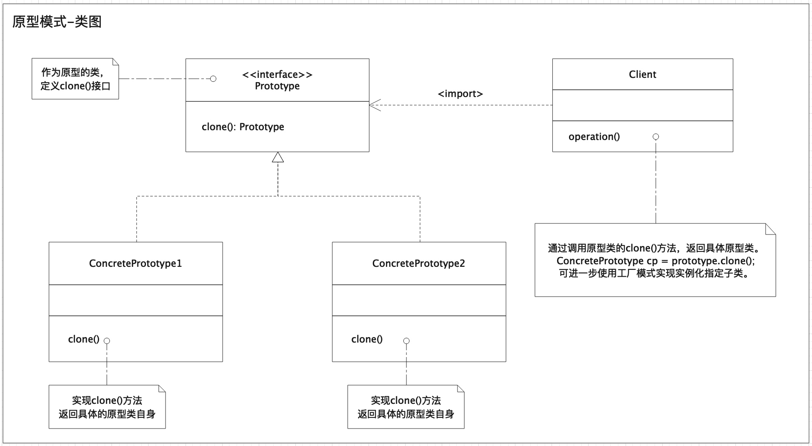

# 原型模式
原型模式是创建型模式的一种，其特点在于通过“复制”一个已经存在的实例，而不是新建实例（复制的成本小于新建的成本时）。被复制的实例就是我们所称的“原型”，这个原型是可以定制的。
## 意图
通过使用低成本的“复制”实例替代高成本的新建实例，即通过用具体原型实例指定创建对象的种类，并且通过拷贝这些原型实例,创建新的对象。
## 适用性
1.多用于创建复杂的或者耗时的实例，因为这种情况下，新建实例的时间成本比较高，通过“复制”一个已经存在的实例更加高效。
2.创建值相同，但是命名不一样的同类数据（还是复制一个对象）。
注意：拷贝分为深拷贝和浅拷贝，如果要实现深拷贝，可以在clone()方法中进行具体实现。
## 类图

## 代码示例
说明：首先定义一个咖啡原型类[CoffeePrototye]，然后定义3个具体咖啡类[BlackCoffee、Cappuccino、Macchiato]，之后在定义一台咖啡机[CoffeeMachine]，最后通过咖啡机来制作咖啡[makeCoffee()]。

``` Java 
public interface CoffeePrototype extends Cloneable, Serializable {

    CoffeePrototype clone() throws CloneNotSupportedException;
}
```
``` Java 
public class BlackCoffee implements CoffeePrototype {

    private static final long serialVersionUID = -8316875130992970641L;

    private String item;

    public BlackCoffee() {

        this.item = "Special item of Black Coffee.";

        try {
            // 模拟添加黑咖啡特殊佐料
            TimeUnit.SECONDS.sleep(1);
            System.out.println("Init Black coffee.Cost 1 seconds.");
        } catch (InterruptedException e) {
            e.printStackTrace();
        }
    }

    @Override
    public CoffeePrototype clone() throws CloneNotSupportedException {

        BlackCoffee coffee = (BlackCoffee) super.clone();

        System.out.println("Make BlackCoffee ...");

        return coffee;
    }

    @Override
    public String toString() {
        return "BlackCoffee{" +
                "item='" + item + '\'' +
                '}';
    }
}
```
``` Java 
public class Cappuccino implements CoffeePrototype {

    private static final long serialVersionUID = -6365799138401412157L;

    private String item;

    public Cappuccino() {
        this.item = "Special item of Cappuccino.";

        try {
            // 模拟添加卡布奇诺特殊佐料
            TimeUnit.SECONDS.sleep(2);
            System.out.println("Init Cappuccino coffee.Cost 2 seconds.");
        } catch (InterruptedException e) {
            e.printStackTrace();
        }
    }

    @Override
    public CoffeePrototype clone() throws CloneNotSupportedException {

        Cappuccino coffee = (Cappuccino) super.clone();

        System.out.println("Make Cappuccino ...");

        return coffee;
    }

    @Override
    public String toString() {
        return "Cappuccino{" +
                "item='" + item + '\'' +
                '}';
    }
}
```
``` Java 
public class Macchiato implements CoffeePrototype {

    private static final long serialVersionUID = -6365799138401412157L;

    private String item;

    public Macchiato() {
        this.item = "Special item of Macchiato.";

        try {
            // 模拟添加玛奇朵特殊佐料
            TimeUnit.SECONDS.sleep(3);
            System.out.println("Init Macchiato coffee. Cost 3 second.");
        } catch (InterruptedException e) {
            e.printStackTrace();
        }
    }


    @Override
    public CoffeePrototype clone() throws CloneNotSupportedException {

        Macchiato coffee = (Macchiato) super.clone();

        System.out.println("Make Macchiato ...");

        return coffee;
    }

    @Override
    public String toString() {
        return "Macchiato{" +
                "item='" + item + '\'' +
                '}';
    }
}
```
``` Java 
public enum CoffeeType {
    /**
     * 黑咖啡
     */
    BLACK_COFFEE,
    /**
     * 卡布奇诺
     */
    CAPPUCCINO,
    /**
     * 玛奇朵
     */
    MACCHIATO,
}
```
``` Java 
public class CoffeeMachine {

    private Map<CoffeeType, CoffeePrototype> map = Maps.newHashMap();

    {
        map.put(CoffeeType.BLACK_COFFEE, new BlackCoffee());
        map.put(CoffeeType.CAPPUCCINO, new Cappuccino());
        map.put(CoffeeType.MACCHIATO, new Macchiato());
    }

    public CoffeePrototype makeCoffee(CoffeeType coffeeType) throws CloneNotSupportedException {

        return map.get(coffeeType).clone();
    }

    /**
     * 客户端-测试
     */
    public static void main(String[] args) throws CloneNotSupportedException {

        /**
         * 初始化咖啡机时就已经将几种可以制作的咖啡实例化一次了
         */
        CoffeeMachine coffeeMachine = new CoffeeMachine();

        /**
         * 每一种咖啡各制作5杯
         */
        Stopwatch stopwatch = Stopwatch.createStarted();
        for (int i = 0; i < 5; i++) {

            BlackCoffee blackCoffee = (BlackCoffee) coffeeMachine.makeCoffee(CoffeeType.BLACK_COFFEE);
            System.out.println(blackCoffee);

            Cappuccino cappuccino = (Cappuccino) coffeeMachine.makeCoffee(CoffeeType.CAPPUCCINO);
            System.out.println(cappuccino);

            Macchiato macchiato = (Macchiato) coffeeMachine.makeCoffee(CoffeeType.MACCHIATO);
            System.out.println(macchiato);
        }
        System.out.println("每一种咖啡各制作5杯,总耗时：" + stopwatch.elapsed(TimeUnit.SECONDS));
    }
}
```

## 客户端测试
执行客户端代码（CoffeeMachine.main()）输出如下：
```
Init Black coffee.Cost 1 seconds.
Init Cappuccino coffee.Cost 2 seconds.
Init Macchiato coffee. Cost 3 second.
Make BlackCoffee ...
BlackCoffee{item='Special item of Black Coffee.'}
Make Cappuccino ...
Cappuccino{item='Special item of Cappuccino.'}
Make Macchiato ...
Macchiato{item='Special item of Macchiato.'}
Make BlackCoffee ...
BlackCoffee{item='Special item of Black Coffee.'}
Make Cappuccino ...
Cappuccino{item='Special item of Cappuccino.'}
...(省略)
每一种咖啡各制作5杯,总耗时：0
```
## 参考链接
[维基百科-原型模式](https://zh.wikipedia.org/wiki/%E5%8E%9F%E5%9E%8B%E6%A8%A1%E5%BC%8F)
[Howtodoinjava-prototype-design-pattern](https://howtodoinjava.com/design-patterns/creational/prototype-design-pattern-in-java/)
[菜鸟教程-原型模式](https://www.runoob.com/design-pattern/prototype-pattern.html)

源码地址: [https://github.com/bruce121/design-patterns.git](https://github.com/bruce121/design-patterns.git)