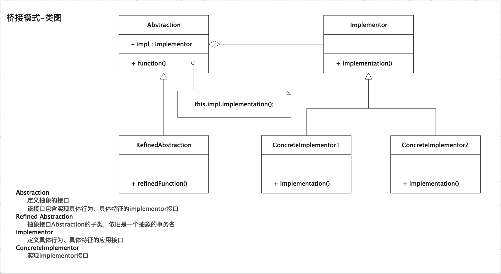
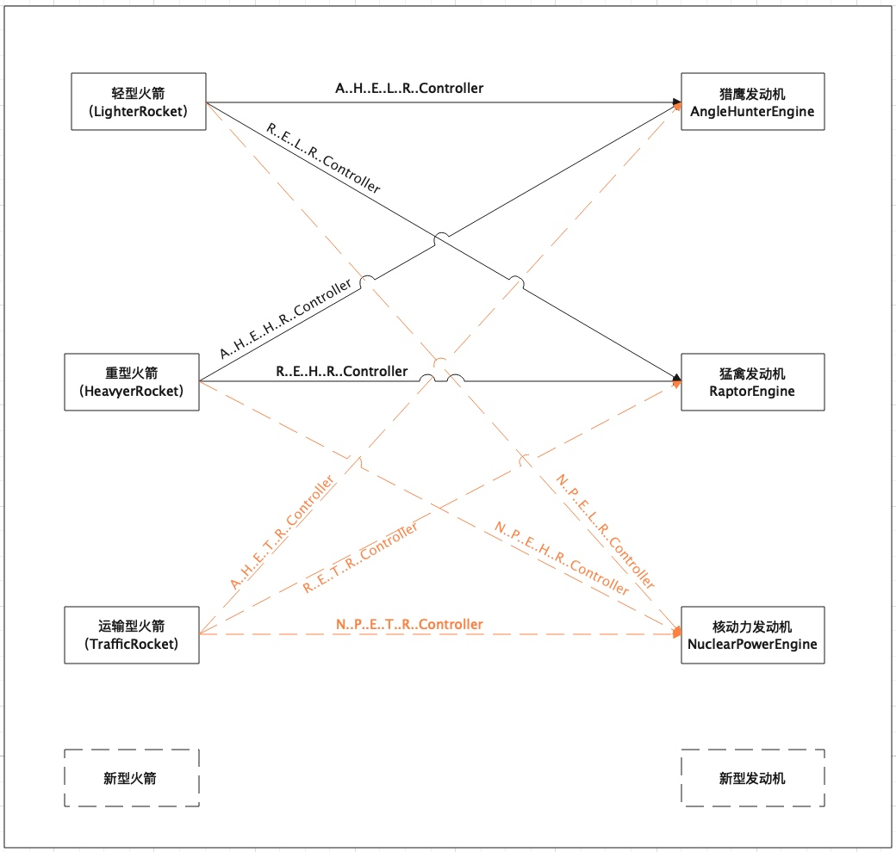

# 桥接模式
桥接模式是软件设计模式中最复杂的模式之一，它把事物对象和其具体行为、具体特征分离开来，使它们可以各自独立的变化。事物对象仅是一个抽象的概念。      
例如：枪械这是一个事物对象，假定它存在瞄准镜、弹匣、枪托这三个维度。      
瞄准镜：四倍镜、八倍镜、红点瞄准镜；(提供瞄准能力)      
弹匣：标准弹匣、加长弹匣；(提供弹药)     
枪托：后方下坠式、前直后坠式、前后平直式；(提高枪械稳定性)      
在这里每个维度都可以独立变化，但每个维度无论怎样变化都会提供一定的"公共基础能力"(具体行为、具体特征)，然后我们基于这些"公共基础能力"就可以组装出一支枪械(事物对象)。
## 意图
将抽象部分与实现部分分离，使它们都可以独立的变化。       
例如：将枪这个事物对象和瞄准镜、弹匣、枪托这几个具备具体行为、具体特征的事物分离开来，不去在意瞄准镜、弹匣、枪托的具体实现，而是关心它们的提供的具体行为、具体特征。
## 适用性
事物对象存在多个维度独立变化的场景。
## 类图

## 场景说明
背景：假设小布入职了伊隆·马斯克的公司造火箭，需要小布对火箭🚀写一个控制程序，来控制火箭的起飞、滑翔、降落。      
现有火箭种类两种：轻型火箭(LighterRocket)、重型火箭(HeavyerRocket)；       
火箭引擎也有两种：猎鹰型(AngelHunterEngine)、猛禽型(RaptorEngine)。      
于是小布针对每一种火箭种类与引擎的搭配，都单独编写了一个控制程序，例如：`LighterRocketWithAngelHunterEngineController`、`HeavyerRocketWithAngelHunterEngineController`、
`LighterRocketWithAngelRaptorEngineController`、
`HeavyerRocketWithAngelRaptorEngineController`。再后来公司又研发出来了一种新火箭种类-运输型火箭(TrafficRocket)和一种新火箭引擎-核动力引擎(NuclearPowerEngine)。于是小布的噩梦开始了，他需要为新的火箭类型和发动机引擎进行排列组合，然后补充新的控制程序。如图中黄色部分所示。

伴随的火箭类型以及发动机引擎类型的增多，这里将发生类爆炸。如果现在老板要求编写一种新的控制程序，可以让轻型火箭在下降的过程中转个圈，那么小布将需要对轻型火箭的所有排列组合出来的控制程序类进行修改。
这种情况下我们就可以使用桥接模式进行设计实现。     
1.首先对系统中可独自进行变化的部分区分开，分为：抽象火箭(AbstractRocket)、发动机实现(EngineImplementor)。     
思考：为什么不是将发动机进行抽象，火箭种类进行实现呢？因为火箭是由发动机聚合而成(火箭中需要发动机作为内部属性)，所以将火箭作为抽象事物进行抽象。在其它场景下，发动机也可以作为一个抽象，那么此时的实现就会是发动机内部的某个行为、特征。       
2.新增火箭类型子类(都继承抽象火箭类)，轻型火箭类(LighterRocket)、重型火箭类(HeavyerRocket)。     
3.新增引擎实现类(都实现发动机接口)，猎鹰发动机(AngleHunterEngine)、猛禽发动机(RaptorEngine)。       
4.初始化火箭具体子类时，将发动机引擎作为构造参数进行传递，生成装配指定引擎的某类火箭。        
5.利用火箭引擎提供的的基础能力，组装成不同类型火箭所具有的特有功能。     
例如：引擎提供的基础能力有[left,up,right,down],我们进行合理组装就可以实现[left-up]的效果，这就是类图中所说的RefinedFunction。
## 代码示例
```java
public abstract class AbstractRocket {

    protected EngineImplementor engineImplementor;

    /**
     * 初始化时需要指定装配的引擎
     */
    public AbstractRocket(EngineImplementor engineImplementor) {

        System.out.println(String.format("[%s] 火箭装配了 [%s] 发动机!", this.getClass().getSimpleName(), engineImplementor.getClass().getSimpleName()));

        this.engineImplementor = engineImplementor;
    }

    /**
     * 点火起飞
     */
    public void fire() {
        System.out.println(this.getClass().getSimpleName() + " 点火开始...");
        engineImplementor.up();
        System.out.println(this.getClass().getSimpleName() + " 点火起飞完成!");
    }

    /**
     * 降落
     */
    public void landing() {

        System.out.println(this.getClass().getSimpleName() + " 火箭降落开始...");
        engineImplementor.down();
        System.out.println(this.getClass().getSimpleName() + " 火箭降落完成!");
    }
}
```
```java
public interface EngineImplementor {

    /**
     * 向左
     */
    void left();

    /**
     * 点火向上
     * 咱也不懂火箭，我们假设火箭向上就代表起飞哈，求生欲拉满
     */
    void up();

    /**
     * 向右
     */
    void right();

    /**
     * 向下
     */
    void down();
}
```
```java
public class LighterRocket extends AbstractRocket {

    /**
     * 初始化时需要指定装配的引擎
     *
     * @param engineImplementor 发动机引擎
     */
    public LighterRocket(EngineImplementor engineImplementor) {
        super(engineImplementor);
    }

    /**
     * 轻型火箭特有功能转圈圈
     */
    public void goingRoundInCircle() {

        System.out.println(this.getClass().getSimpleName() + " 转圈圈开始...");
        // 我们就假设利用引擎的不同推力方向就能实现转圈圈
        engineImplementor.left();
        engineImplementor.up();
        engineImplementor.right();
        engineImplementor.down();
        System.out.println(this.getClass().getSimpleName() + " 利用引擎的基础能力进行了转圈圈!");
    }
}
```
```java
public class HeavyerRocket extends AbstractRocket {

    /**
     * 初始化时需要指定装配的引擎
     *
     * @param engineImplementor 发动机引擎
     */
    public HeavyerRocket(EngineImplementor engineImplementor) {
        super(engineImplementor);
    }

    /**
     * 重型火箭的特有能力（加速飞行）
     */
    public void speedUpFlying() {
        System.out.println(this.getClass().getSimpleName() + " 加速飞行开始...");
        engineImplementor.up();
        engineImplementor.up();
        engineImplementor.up();
        engineImplementor.up();
        System.out.println(this.getClass().getSimpleName() + " 利用引擎的基础能力进行了加速飞行!");

    }

}
```
```java
public class TrafficRocket extends AbstractRocket {

    /**
     * 初始化时需要指定装配的引擎
     *
     * @param engineImplementor
     */
    public TrafficRocket(EngineImplementor engineImplementor) {
        super(engineImplementor);
    }

    /**
     * 运输火箭特有功能-悬停
     */
    public void hoverInTheAir() {

        System.out.println(this.getClass().getSimpleName() + " 悬停开始...");

        // 假设这样就能悬停
        engineImplementor.up();
        engineImplementor.down();

        System.out.println(this.getClass().getSimpleName() + " 利用引擎的基础能力进行了悬停!");
    }

}
```
```java
public class AngelHunterEngine implements EngineImplementor {

    @Override
    public void left() {
        System.out.println(this.getClass().getSimpleName() + "---left");
    }

    @Override
    public void up() {
        System.out.println(this.getClass().getSimpleName() + "---up");
    }

    @Override
    public void right() {
        System.out.println(this.getClass().getSimpleName() + "---right");
    }

    @Override
    public void down() {
        System.out.println(this.getClass().getSimpleName() + "---down");
    }
}
```
```java
public class RaptorEngine implements EngineImplementor {
// ... 省略
}
```
```java
public class NuclearPowerEngine implements EngineImplementor {
// ... 省略
}
```
```java
public class RocketControlClient {

    public static void main(String[] args) {

        AngelHunterEngine angelHunterEngine = new AngelHunterEngine();
        HeavyerRocket heavyerRocket = new HeavyerRocket(angelHunterEngine);

        // 点火
        heavyerRocket.fire();
        // 加速飞行
        heavyerRocket.speedUpFlying();
        // 降落
        heavyerRocket.landing();

        System.out.println("---------------------------------------");

        RaptorEngine raptorEngine = new RaptorEngine();
        LighterRocket lighterRocket = new LighterRocket(raptorEngine);
        // 点火
        lighterRocket.fire();
        // 转圈圈
        lighterRocket.goingRoundInCircle();
        // 降落
        lighterRocket.landing();

        System.out.println("---------------------------------------");

        NuclearPowerEngine nuclearPowerEngine = new NuclearPowerEngine();
        TrafficRocket trafficRocket = new TrafficRocket(nuclearPowerEngine);
        // 点火
        trafficRocket.fire();
        // 悬停
        trafficRocket.hoverInTheAir();
        // 降落
        trafficRocket.landing();
    }
}
```
## 客户端测试
执行客户端代码（RocketControlClient.main()）输出如下：
```
[HeavyerRocket] 火箭装配了 [AngelHunterEngine] 发动机!
HeavyerRocket 点火开始...
AngelHunterEngine---up
HeavyerRocket 点火起飞完成!
HeavyerRocket 加速飞行开始...
AngelHunterEngine---up
AngelHunterEngine---up
AngelHunterEngine---up
AngelHunterEngine---up
HeavyerRocket 利用引擎的基础能力进行了加速飞行!
HeavyerRocket 火箭降落开始...
AngelHunterEngine---down
HeavyerRocket 火箭降落完成!
---------------------------------------
[LighterRocket] 火箭装配了 [RaptorEngine] 发动机!
LighterRocket 点火开始...
RaptorEngine---up
LighterRocket 点火起飞完成!
LighterRocket 转圈圈开始...
RaptorEngine---left
RaptorEngine---up
RaptorEngine---right
RaptorEngine---down
LighterRocket 利用引擎的基础能力进行了转圈圈!
LighterRocket 火箭降落开始...
RaptorEngine---down
LighterRocket 火箭降落完成!
---------------------------------------
[TrafficRocket] 火箭装配了 [NuclearPowerEngine] 发动机!
TrafficRocket 点火开始...
NuclearPowerEngine---up
TrafficRocket 点火起飞完成!
TrafficRocket 悬停开始...
NuclearPowerEngine---up
NuclearPowerEngine---down
TrafficRocket 利用引擎的基础能力进行了悬停!
TrafficRocket 火箭降落开始...
NuclearPowerEngine---down
TrafficRocket 火箭降落完成!
```
如此一来，我们就实现了"火箭抽象"与"引擎实现"的独立变化。每种火箭都可以有自己的独特能力，但这些能力一定是基于其内部属性元素(引擎实现)的基础能力组合而成。这时我们甚至可以再向火箭中聚合一个"火箭整流罩"，然后整流罩可以有不同的实现。甚至不同整流罩的特有功能也是由其内部属性元素的基础能力组合而成(~~无限、有限~~套娃)。
## 参考链接
[维基百科-桥接模式](https://zh.wikipedia.org/wiki/%E6%A9%8B%E6%8E%A5%E6%A8%A1%E5%BC%8F)     
[Howtodoinjava-bridge-design-pattern](https://howtodoinjava.com/design-patterns/structural/bridge-design-pattern/)      
[菜鸟教程-桥接模式](https://www.runoob.com/design-pattern/bridge-pattern.html)      
        
源码地址: [https://github.com/bruce121/design-patterns.git](https://github.com/bruce121/design-patterns.git)