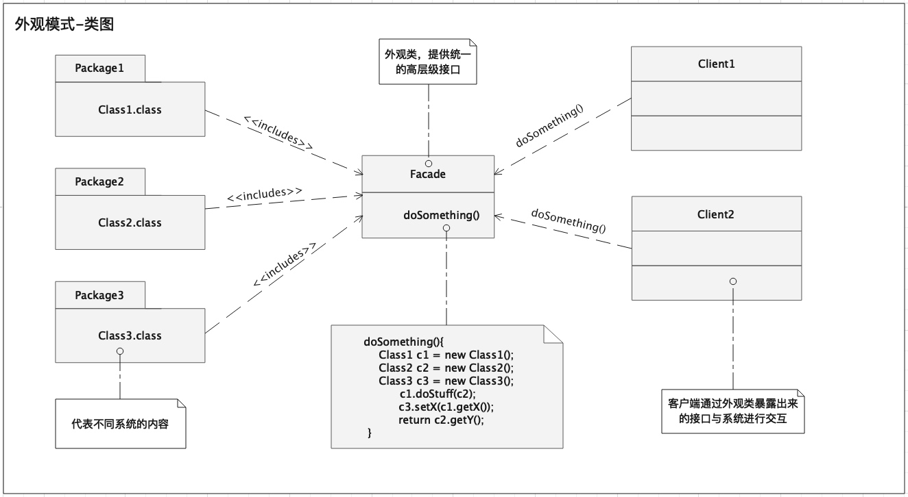

# 外观模式
外观模式（Facade pattern），是软件工程中常用的一种软件设计模式，它为子系统中的**一组接口**(a set of interfaces)提供一个统一的**高层级接口**(High-Level Interface)，使得子系统更容易使用。

外观模式的例子在现实中比比皆是，例如：
1.电脑开机，用户只需要按一下开机按钮，然后静等开机就可以了，这里计算机对硬件及软件等不同系统进行的操作被隐藏了起来（内部操作细节对用户不可见），这就是一种外观模式；
2.咖啡制作，用户买了一杯咖啡，用户不需要知道咖啡具体的制作流程（制作细节对用户不可见），只需要等着销售员做好就可以了，这里的销售员就是一个“门面”，提供了一个叫做“制作咖啡”的高层级接口。

注意：一个系统中可以有N个外观类，也可以为一组外观类定义一个更高层级的外观类（可以套娃）...
## 意图
为客户端提供一组简单易用的接口，将客户端操作与众多系统解耦，隐藏系统的内部复杂性。客户端不与系统耦合，但是外观类与系统耦合。
## 适用性
1.客户端不需要知道内部系统复杂的实现细节。
2.定义系统统一入口（定义High-level interface）。
## 类图

## 代码示例
说明：3岁小朋友饿了，叫他妈妈给做饭，他妈妈首先叫菜市场配送人员送了菜，然后又找厨师进行了烹饪，最后叫美盘师进行了装盘，然后妈妈端菜上桌，小朋友吃饭。
这里妈妈充当了外观类，通过妈妈协调配送人员、配菜人员、厨师、美盘师最终实现了“做饭”这个事情。
```java
public class RawDishes {
//...（省略）
}
public class CookedDishes {
//...（省略）
}
public class BeautyDishes {
//...（省略）
}
```
```java
public class DeliveryStaff {
    /**
     * 配送人员送菜
     */
    public static RawDishes getRawDishes() {

        System.out.println("配送人员送来了菜!");
        return new RawDishes();
    }
}
```
```java
public class HeadChef {
    /**
     * 厨师做了一顿东北菜
     *
     * @param rawDishes 原材料
     * @return 做好的菜品
     */
    public static CookedDishes cookInDongBeiCaiStyle(RawDishes rawDishes) {

        System.out.println("厨师长做了一顿东北菜!");
        return new CookedDishes(rawDishes);
    }
}
```
```java
public class DishBeautician {
    /**
     * 美盘师 对厨师做好的食物进行了美盘
     * @param cookedDishes 做好的菜品
     * @return 进行了美盘后的菜品
     */
    public static BeautyDishes beautyCookedDishes(CookedDishes cookedDishes) {

        System.out.println("美盘师对食物进行了美盘!");
        return new BeautyDishes(cookedDishes);
    }
}
```
```java
public class MommyFacade {
    public BeautyDishes cookDinner() {
        // 妈妈首先让送菜员送来了原材料
        RawDishes rawDishes = DeliveryStaff.getRawDishes();
        // 厨师使用原材料进行烹饪
        CookedDishes cookedDishes = HeadChef.cookInDongBeiCaiStyle(rawDishes);
        // 美盘师进行美盘
        BeautyDishes beautyDishes = DishBeautician.beautyCookedDishes(cookedDishes);
        return beautyDishes;
    }
}
```
```java
public class ChildClient {
    public static void main(String[] args) {
        MommyFacade mom = new MommyFacade();
        BeautyDishes beautyDishes = mom.cookDinner();
        System.out.println(beautyDishes);
    }
}
```
## 客户端测试
执行客户端代码（ChildClient.main()）输出如下：
```
配送人员送来了菜!
厨师长做了一顿东北菜!
美盘师对食物进行了美盘!
BeautyDishes{vegetables='蔬菜-Cooked-Beauty!', meat='肉-Cooked-Beauty!', soup='汤-Cooked-Beauty!'}
```
对于小孩来说，只叫了妈妈做晚餐，但是这里晚餐是如何被做出来的，小朋友是不知道的，所以说这里妈妈充当了外观类，隐藏了做晚餐的细节。
## 参考链接
[维基百科-外观模式](https://zh.wikipedia.org/wiki/%E5%A4%96%E8%A7%80%E6%A8%A1%E5%BC%8F)
[Howtodoinjava-facade-design-pattern](https://howtodoinjava.com/design-patterns/structural/facade-design-pattern/)
[菜鸟教程-外观模式](https://www.runoob.com/design-pattern/facade-pattern.html)

源码地址: [https://github.com/bruce121/design-patterns.git](https://github.com/bruce121/design-patterns.git)
